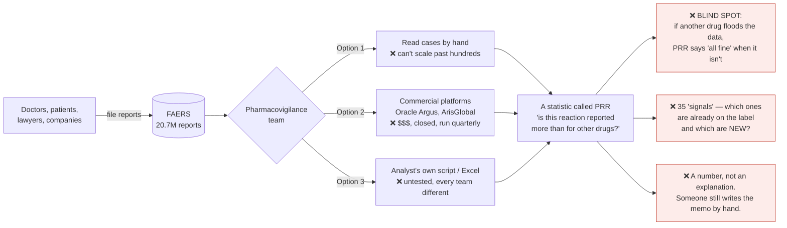
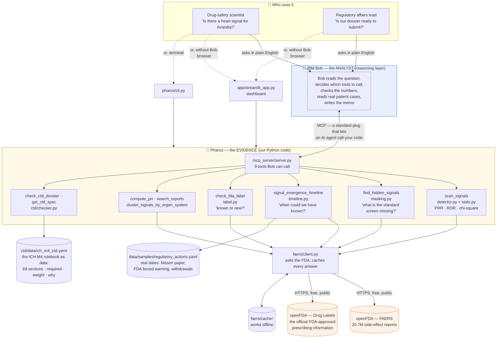

# Pharos — the big picture, in plain English

Read this once and you can explain the whole project to anyone: a mentor, a juror, your grandmother. No jargon without a translation. Every box in every diagram names the real dataset, tool, or Python file behind it.

---

## 1. The real-world problem, as a story

**A drug gets approved.** It was tested on maybe 3,000–5,000 people. Then it is sold to *millions*. Rare side effects — the ones that hit 1 person in 10,000 — are mathematically invisible in a trial that size. They only show up after launch.

**So every country runs a complaint box.** In the US it's called **FAERS** (FDA Adverse Event Reporting System). A doctor, a patient, a lawyer, or the drug company itself fills in a report: *"patient took drug X, then had a heart attack."* One report proves nothing. But patterns across thousands of reports are the earliest warning system medicine has.

**The complaint box now holds 20.7 million reports** and grows by over a million a year.

**Inside every pharma company and every regulator there is a team whose whole job is to read that box** — the *pharmacovigilance* team (literally "drug watchfulness"). Their question, every week, for every product: *is anything showing up more often than it should?*

**The famous failure:** Vioxx, a painkiller, 1999–2004. The heart-attack pattern was in the data. It was withdrawn after an estimated 27,000+ heart attacks and sudden cardiac deaths. Nobody was hiding it — there was simply too much data and too few eyes.

**The second half of the problem** is at the *other* end of a drug's life. To get a drug approved you submit a **dossier**: ~100,000 pages in a rigid five-part structure every regulator in the world agreed on (the **CTD**, defined by a guideline called **ICH M4**). Forget one required section and the agency refuses to even start reviewing it: 6–12 months lost, $50–100 million gone. Today that checklist lives in spreadsheets.

Both halves are the same disease: **too much structured data, not enough attention.**

---

## 2. What companies do today — and where it breaks

**PRR in one sentence:** *"4% of reports about Drug X mention heart attacks; across every other drug it's 1%. 4 ÷ 1 = PRR of 4."* If PRR ≥ 2 (with enough cases and a statistical sanity check), that's a **signal** — a flag saying "a human should look at this". It is twenty years old, regulators use it, and it is the method the problem statement told us to implement.

The three red boxes are the gaps. **Pharos closes all three.**

---

## 3. What we were asked to build vs. what we built vs. what we invented

| | The problem statement asked for | What Pharos does | Where in the code |
|---|---|---|---|
| **Asked** | "Cluster adverse event reports" | Groups signals by body system (heart, liver, skin…) so you see *"this is a cardiac problem"*, not 30 separate terms | `src/pharos/signals/cluster.py` |
| **Asked** | "Calculate PRR statistics to flag emerging safety signals" | PRR **plus** ROR, confidence intervals, chi-square, the standard Evans-2001 rule — on the **live FDA database**, not a sample | `src/pharos/signals/stats.py`, `detector.py`, `faers/client.py` |
| **Asked** | "Check a dossier outline against ICH M4 CTD, score completeness per module, generate a gap report" | 69-section machine-readable checklist, weighted scores, gaps ranked critical / major / minor with *why it matters* | `src/pharos/ctd/` |
| **Asked** | "Build a **Bob** solution" | Bob is the analyst: it calls our 9 tools, verifies, reads real cases, writes the memo | `src/mcp_server/server.py` |
| 🆕 **Our idea** | — | **When** could this have been caught? Year-by-year replay using only what the FDA had received by each year-end, against real regulatory dates | `src/pharos/signals/timeline.py` |
| 🆕 **Our idea** | — | **What hid it?** Detects when another drug floods the data ("masking") and corrects for it — by a fixed rule, with no look-ahead | `timeline.py`, `masking.py` |
| 🆕 **Our idea** | — | **Hidden-signal finder:** for *any* drug, lists the signals the standard method is missing right now | `src/pharos/signals/masking.py` |
| 🆕 **Our idea** | — | **Known or new?** Checks each signal against the drug's actual FDA label: boxed warning / warnings / adverse reactions / **not on the label** | `src/pharos/signals/label.py` |
| 🆕 **Our idea** | — | Filters out non-medical noise ("drug ineffective", "off-label use") that otherwise tops every list | `detector.py` |
| 🆕 **Our idea** | — | Works with no internet: every FDA answer is cached to disk | `faers/client.py`, `faers/cache/` |

---

## 4. How Pharos works — the whole machine on one page

**The one design decision to remember:** *Pharos never writes opinions; Bob never invents numbers.* Pharos is ordinary tested Python that returns tables. Bob is the AI that reads those tables and explains them. Take Bob away → you get numbers with no explanation. Take Pharos away → Bob would be guessing at statistics, which in medicine is dangerous. Together they behave like a careful junior safety scientist who shows their working.

---

## 5. The discovery — told as a story (this is the pitch)

```mermaid
flowchart TD
    A["2007: a famous paper (Nissen, NEJM) says the diabetes drug<br/><b>Avandia</b> raises heart-attack risk. FDA adds its strongest warning."]
    A --> B["We asked Pharos: using only the reports the FDA ALREADY HAD,<br/>when would the standard method have raised the flag?"]
    B --> C["😞 Answer: <b>2008</b>. A year AFTER the paper.<br/>The early-warning system warned late."]
    C --> D{"Why? Pharos looked at WHO was filing<br/>the heart-attack reports each year"}
    D --> E["2005: <b>69%</b> of ALL heart-attack reports in FAERS were about one drug — <b>Vioxx</b><br/>2006: <b>73%</b>. Lawyers were filing thousands of Vioxx reports for lawsuits."]
    E --> F["PRR compares Avandia with 'all other drugs'.<br/>But 'all other drugs' was now mostly Vioxx heart attacks.<br/>Next to that mountain, Avandia looked SAFE (PRR 0.77 — below 1!)"]
    F --> G["This is called <b>MASKING</b>. It's known in research (there is even a 2025 research tool for it).<br/>It is not part of the routine screen."]
    G --> H["Pharos removes Vioxx from the comparison — chosen by a fixed rule,<br/>applied year by year, never using knowledge from the future."]
    H --> I["✅ Corrected answer: <b>2006</b>. A year BEFORE the paper.<br/>Same data. Same statistic. We just asked: <i>what is hiding this?</i>"]
    I --> J["And it's not a one-off: ask Pharos 'what's hidden for Avandia as of 2006?'<br/>→ it finds heart attack by itself, AND shows heart failure<br/>(Avandia's real boxed warning) understated by a third."]

    style C fill:#fdecea,stroke:#c0392b
    style I fill:#eafaf1,stroke:#27ae60
    style J fill:#eafaf1,stroke:#27ae60
```

**Everyday analogy for masking:** you're trying to hear whether one person in a room is coughing more than normal. Then someone starts a fire alarm. The cough didn't stop — you just can't hear it. Pharos notices the alarm, tells you which alarm it is, and listens again with it filtered out.

**Why we trust the result — three honesty rules we built in:**
1. **No time travel.** Each year uses only reports the FDA had received by that 31 December.
2. **No cherry-picking.** The drug to exclude is chosen by a rule (any single product ≥ 25% of a reaction's reports), not by us.
3. **No look-ahead.** A product is excluded only from the first year it crossed that line. (Our first automatic version said "2005" — because it used a 2007 fact in 2005. We caught it, fixed it, and wrote a test so it can't come back. The honest answer is 2006.)

---

## 6. Where IBM Bob fits — two different jobs

| | What Bob does | How to show it |
|---|---|---|
| **Bob REVIEWED it** | Ask mode: Bob read `stats.py` and checked the PRR, ROR and chi-square formulas against the published method | `demo/screenshots/08-bob-ask-mode.png` |
| **Bob RUNS it** *(the important one)* | You type one question. Bob calls `scan_signals`, notices Vioxx at 73%, **decides by itself** to re-run with the correction, calls `compute_prr` to double-check, pulls real patient cases, and writes a memo with a recommendation | `demo/screenshots/05a–05c, 06`, `demo/transcripts/vioxx-signal-memo-by-bob.html` |

The connection is **MCP** (Model Context Protocol) — think of it as a USB port for AI agents. We wrote `src/mcp_server/server.py`, which describes our 9 functions in a way Bob understands. Bob plugs in, sees the tools, and uses them. This is the exact architecture the hackathon template draws as its example: *User → Bob → MCP → your server → data.*

---

## 7. A day in the life — before and after

| | **Before Pharos** | **With Pharos** |
|---|---|---|
| Monday question | "Anything new on our diabetes drug?" | Same question, typed to Bob |
| How long | Days: export data, run a script, build a spreadsheet, write a memo | About a minute |
| What you get | A PRR number | The number **+** its confidence interval **+** whether it's already on the label **+** when it first appeared **+** whether something is masking it **+** real patient cases **+** a written recommendation |
| If another drug is flooding the data | You never find out. PRR says "fine". | 🎭 "Masking detected — Vioxx is 73% of these reports. Corrected PRR: 2.18." |
| 35 signals on screen | All look equally urgent | "31 already on the label. **4 are not — start there.**" |
| Dossier check | Spreadsheet, found by the regulator | 75% complete, 10 critical gaps, *"you listed Toxicology as one block — it needs seven sub-sections"* |
| Can you trust it? | Depends who wrote the script | 80 automated tests, every formula checked against a hand calculation, every number traceable to an FDA query |

---

## 8. Glossary — the ten words you need

| Word | Plain meaning |
|---|---|
| **Adverse event** | Something bad that happened to a patient on a drug. *Not* proof the drug caused it. |
| **FAERS** | The FDA's public complaint box for side effects. 20.7M reports. Free. |
| **openFDA** | The FDA's free web API. We use two parts: side-effect reports, and official drug labels. |
| **Pharmacovigilance** | The job of watching for drug side effects after launch. |
| **Signal** | A statistical flag: "this reaction is reported unusually often with this drug — look." Not a verdict. |
| **PRR** | Proportional Reporting Ratio. *(Share of this drug's reports mentioning the reaction) ÷ (same share for all other drugs).* ≥ 2 is a flag. |
| **Masking** | One drug's flood of reports inflates the "all other drugs" baseline and hides real signals for everyone else. |
| **Labelled** | Already listed on the drug's official FDA label. A labelled signal is expected; an unlabelled one is news. |
| **Boxed warning** | The FDA's strongest warning — a black box at the top of the label. |
| **CTD / ICH M4** | The worldwide standard table-of-contents for a drug approval application. 5 modules. |
| **MCP** | Model Context Protocol — the standard plug that lets an AI agent (Bob) call your code. |

---

## 9. Brainstorm starters — questions worth arguing about as a team

1. **Who pays for this?** Small pharma and generics makers can't afford Oracle Argus. Regulators in lower-income countries have nothing. Academic researchers re-write the same script every paper. Which of these is our first user?
2. **What else gets masked?** Litigation waves are common: Xarelto (bleeding), Zantac (cancer), Chantix (suicidality), Yaz (blood clots), Accutane. Each one is probably hiding signals for *other* drugs right now. Could Pharos produce a "most-masked reactions in FAERS today" league table?
3. **Could this run every night?** A watch-list of 50 drugs, re-scanned daily, Bob emails you only when something *new and unlabelled* appears.
4. **Beyond the US:** Europe (EudraVigilance), WHO (VigiBase), India (PvPI) all have complaint boxes. Same maths.
5. **The other direction:** when Pharos finds a new unlabelled signal, the company must update the label — which means a new regulatory submission — which is Mode 2. The two modes are one loop.
6. **What would make a regulator trust it?** Every number links to the exact FDA query that produced it; every rule is fixed and written down; the AI never touches the arithmetic.
