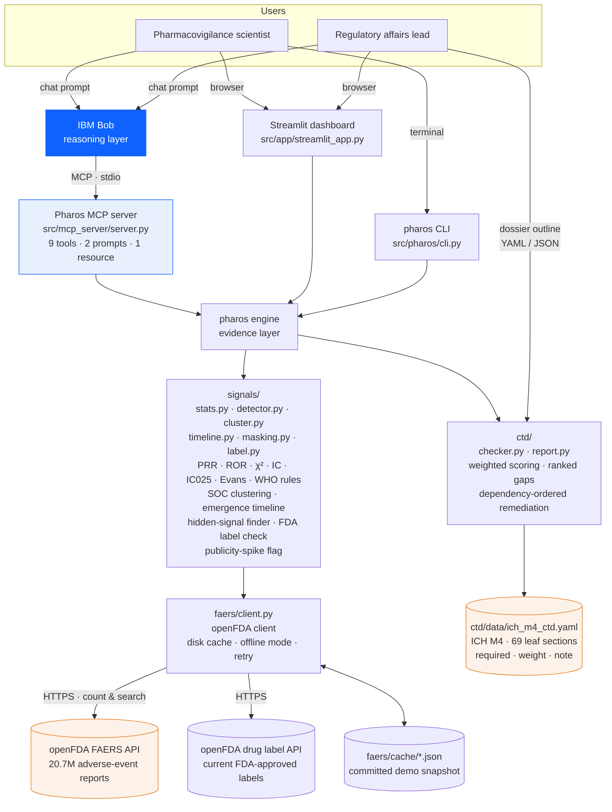

# Architecture

## System diagram



## Components

| Component | Technology | Responsibility |
|---|---|---|
| **IBM Bob** | IBM Bob IDE / CLI, MCP client | The analyst. Calls Pharos tools, verifies signals with exact queries, reads case narratives, writes the signal-assessment memo or dossier remediation plan. Uses Ask mode to review the statistics module without making changes. |
| **Pharos MCP server** | Python, `mcp` 2.x (`MCPServer`), stdio transport | Exposes `scan_signals`, `compute_prr`, `cluster_signals_by_organ_system`, `search_reports`, `find_hidden_signals`, `check_fda_label`, `signal_emergence_timeline`, `check_ctd_dossier`, `get_ctd_spec`; prompt templates `signal_assessment`, `dossier_gap_memo`; resource `pharos://about`. Server instructions require Bob to state n / PRR / CI / χ² and avoid causal language; IC025 and stimulated-reporting fields are now included in every scan and timeline row with explicit interpretation guidance. |
| **Streamlit dashboard** | Streamlit, Plotly, pandas | Two tabs. Signal Detection: drug input, criteria sliders, PRR bar chart with CIs, organ-system chart, "All evaluated reactions" table (includes **IC025** column and methods-disagree caption), 2×2 drill-down, hidden-signal finder, timeline (with **publicity-spike shading** and stimulated-year caption), CSV/JSON export, Bob prompt. Submission Readiness: sample/upload outline, module completeness bars, ranked gaps, dependency-ordered remediation table, warnings, Markdown report download, Bob prompt. |
| **CLI** | Typer, Rich | `scan`, `prr` (now shows IC / IC025 / WHO verdict), `timeline` (📣 flag for stimulated years), `hidden`, `ctd-check`, `ctd-template`, `build-cache`, `version`. Rich tables; `--json` for pipelines. |
| **signals/stats.py** | pure Python | `ContingencyTable`, PRR/ROR + 95% CI, Yates χ², Haldane correction, `ic()`, `ic025()` (Norén 2013 shrinkage form), `SignalCriteria`, `evaluate()` → `DisproportionalityResult` (adds `ic`, `ic025`, `is_signal_ic`, `methods_agree`). Every metric hand-tested in `tests/test_stats.py`. |
| **signals/detector.py** | pandas | `scan_drug()` — one drug × all its reactions; IC columns included in every row; `n_methods_disagree` in `as_dict()`. `compute_pair()` — exact AND query for one pair, IC fields flow through automatically. |
| **signals/cluster.py** | pandas | MedDRA SOC assignment (curated ~300-term map + keyword rules, labelled `heuristic`) and per-SOC aggregation. |
| **signals/timeline.py** | pandas, PyYAML | `signal_timeline()` — per-year 2×2 by FDA receive date; yearly + cumulative PRR; optional masking correction (`exclude` / `auto`); `detect_masking` (top contributing drugs per year, alert ≥ 25%); **publicity-spike flag**: `stimulated_reporting` and `share_vs_baseline` on every row, `TimelineResult.stimulated_years` property, caution sentence in `headline()`; lead time vs `regulatory_actions.yaml`. |
| **signals/masking.py** | pandas | `find_hidden_signals()` — per-reaction background decomposition, fixed-rule masker detection, corrected PRR; brand/generic alias expansion. |
| **signals/label.py** | — | Fetches current US label (SPL) from openFDA; matches each signal against boxed warning, W&P, adverse reactions; British→American spelling and lay synonyms. |
| **faers/client.py** | httpx | openFDA query builder (multi-name OR), SHA-1 keyed JSON disk cache, `PHAROS_OFFLINE`, 404-as-zero, 429/5xx backoff, keyless 500-term count cap. |
| **ctd/checker.py** | PyYAML, difflib | Load spec (region variant), parse outline, id normalisation + fuzzy title match, weighted per-module score, ranked `Gap`s with `blocks` field, Kahn-sorted `remediation_order`, warnings. |
| **ctd/report.py** | — | Markdown gap report, dependency-ordered remediation section. |
| **ctd/data/ich_m4_ctd.yaml** | YAML | ICH M4 checklist: Modules 1 (US/EU variants), 2, 3, 4, 5; 69 leaves; `required`, `weight`, `note`, `depends_on`. |
| **tests/** | pytest | **103 tests**, all offline. Statistics against hand-computed 2×2 (including IC/IC025 with hand-derived expected values); detector, timeline (no-look-ahead, stimulated-reporting), hidden-signal finder, label matcher, CTD checker — all against fake clients/data, no network. |

## Data flow — Mode 1 (signal scan)

1. User (or Bob) supplies drug name + aliases, e.g. `rofecoxib`, `vioxx`.
2. `OpenFDAClient.drug_expression()` builds a multi-field OR query across verbatim and harmonised name fields.
3. Four requests: **N** (all reports), **drug total**, **drug's reaction counts** (up to 500), **background reaction counts** (top-500 FAERS-wide). Rare reactions fall back to one request each (capped at `max_extra_lookups`).
4. For each reaction: `ContingencyTable.from_counts(a, drug_total, event_total, N)` → `evaluate()` → PRR, CI, ROR, CI, χ², Evans signal flag, tier, **IC**, **IC025**, **is_signal_ic** (WHO rule), **methods_agree**.
5. Rows ranked (clinical signals → statistical-only → non-signals, by PRR); `cluster_signals()` groups by SOC; `n_methods_disagree` summarised in `as_dict()`.
6. Output: `ScanResult` → Rich table (CLI) / Plotly + DataFrame with IC025 column (UI) / JSON (MCP → Bob).
7. Bob: calls `compute_prr` for exact verification, `search_reports` for narratives, then writes the memo noting IC agreement/disagreement where relevant.

Every response cached under `src/pharos/faers/cache/<sha1(url)>.json`; `PHAROS_OFFLINE=1` uses only the cache.

## Data flow — emergence timeline

1. For each year *Y*: `receivedate:[Y0101 TO Y1231]` ANDed onto four counts → that year's 2×2. Running sums give the cumulative 2×2.
2. If `exclude`: two subtracted counts → masking-corrected yearly and cumulative series.
3. If `detect_masking`: top contributing drugs by share; ≥ 25% raises `masking_alert`.
4. **Publicity-spike flag (phase 3, zero extra API calls):** baseline = mean `share_of_drug_reports_pct` for rows before the first regulatory action. A row is `stimulated_reporting=True` when year ≥ action year **and** share ≥ 2 × baseline. This distinguishes media/litigation-driven reporting from genuine risk increase — convention, not a published standard, and labelled as such everywhere.
5. First-flag years (standard / corrected) compared with `regulatory_actions.yaml` → lead times; `headline()` includes both the masking result and the stimulated-reporting caution.

## Data flow — Mode 2 (dossier check)

1. Outline (YAML/JSON) → `parse_outline()` → `OutlineEntry` list + metadata.
2. `load_spec(region)` → five `SpecModule`s; leaves indexed by normalised id and title.
3. Each entry matched: exact id → leaf; parent id → warning; fuzzy title ≥ 0.86 → leaf + confirm-warning; else → unrecognised.
4. Per module: `score = Σ weight × status_score / Σ weight` over required leaves; `Gap` for each missing/draft leaf with severity, `depends_on`, and `blocks`.
5. `order_gaps()` (Kahn topological sort) → `remediation_order`: a dependency-respecting fix-first list.
6. `CTDCheckResult` → Rich (CLI) / Plotly + ranked-gap table + remediation table (UI) / JSON + Markdown (MCP → Bob writes the remediation memo in dependency order).

## Security and operational notes

- **No credentials required.** openFDA is public. An optional `OPENFDA_API_KEY` lifts rate limits; read from `.env` (git-ignored). `.env.example` is the template.
- **No PHI.** FAERS reports are de-identified public records; Pharos stores only aggregate counts and trimmed report fields.
- **Deterministic core.** Everything under `pharos/` is pure functions over data; no LLM calls, no randomness. The only non-determinism is Bob's prose.
- **Rate limits.** Keyless: 240 req/min, 1,000/day per IP, count `limit ≤ 500`. Client backs off on 429; cache makes repeat queries free.
- **Scalability path.** Swap `faers/client.py` for a FAERS quarterly-file loader or Postgres mirror; the `ContingencyTable` interface stays unchanged. IC is already implemented; EBGM/BCPNN (Bayesian shrinkage) slot in alongside it in `stats.py` following the same pattern (`add-signal-metric` skill documents the exact steps).

## Repository map

```
src/pharos/faers/client.py        openFDA access + cache
src/pharos/signals/stats.py       2×2 statistics — PRR · ROR · χ² · IC · IC025 (tested)
src/pharos/signals/detector.py    scan + pair analysis (IC columns, n_methods_disagree)
src/pharos/signals/cluster.py     SOC clustering
src/pharos/signals/timeline.py    emergence timeline + masking + publicity-spike flag
src/pharos/signals/masking.py     hidden-signal finder, alias groups
src/pharos/signals/label.py       FDA label check (known vs new)
src/pharos/ctd/checker.py         CTD matching + scoring + dependency-ordered remediation
src/pharos/ctd/report.py          Markdown gap report
src/pharos/ctd/data/ich_m4_ctd.yaml
src/pharos/cli.py                 Typer CLI
src/mcp_server/server.py          IBM Bob MCP server (9 tools)
src/app/streamlit_app.py          dashboard
src/tests/                        pytest — 103 tests, all offline
```
