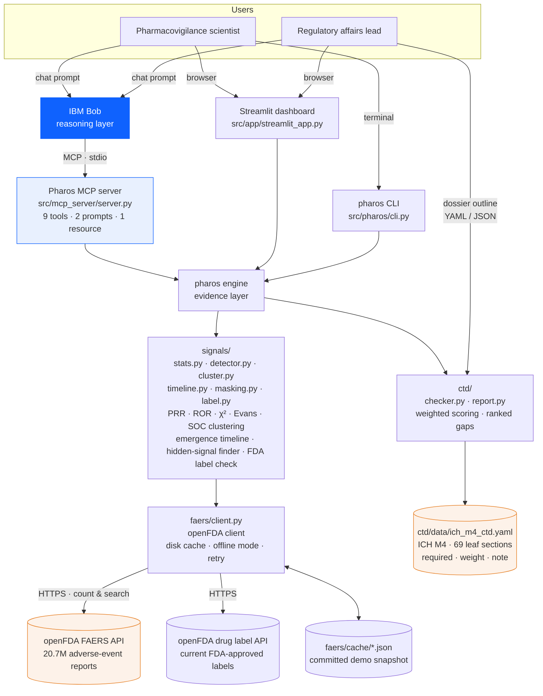

# Architecture

## System diagram



## Components

| Component | Technology | Responsibility |
|---|---|---|
| **IBM Bob** | IBM Bob IDE / CLI, MCP client | The analyst. Calls Pharos tools, verifies signals, reads cases, writes the signal-assessment memo or dossier remediation plan. Also used in Ask mode to review the statistics module. |
| **Pharos MCP server** | Python, `mcp` 2.x (`MCPServer`), stdio transport | Exposes `scan_signals`, `compute_prr`, `cluster_signals_by_organ_system`, `search_reports`, `find_hidden_signals`, `check_fda_label`, `signal_emergence_timeline`, `check_ctd_dossier`, `get_ctd_spec`; prompt templates `signal_assessment`, `dossier_gap_memo`; resource `pharos://about`. Server instructions constrain Bob to state n / PRR / CI / χ² and avoid causal language. |
| **Streamlit dashboard** | Streamlit, Plotly, pandas | Two tabs. Signal Detection: drug input, criteria sliders, PRR bar chart with CIs, organ-system chart, table, 2×2 drill-down, CSV/JSON export, Bob prompt. Submission Readiness: sample/upload outline, module completeness bars, ranked gaps, warnings, Markdown report download, Bob prompt. |
| **CLI** | Typer, Rich | `scan`, `prr`, `ctd-check`, `ctd-template`, `build-cache`, `version`. Rich tables; `--json` for pipelines. |
| **signals/stats.py** | pure Python | `ContingencyTable`, PRR/ROR + 95% CI, Yates χ², Haldane correction, `SignalCriteria`, `evaluate()`. |
| **signals/detector.py** | pandas | `scan_drug()` — one drug × all its reactions; administrative-term filter; ranking. `compute_pair()` — exact AND query for one pair. |
| **signals/cluster.py** | pandas | MedDRA SOC assignment (curated ~300-term map + keyword rules, labelled `heuristic`) and per-SOC aggregation. |
| **signals/timeline.py** | pandas, PyYAML | `signal_timeline()` — per-year 2×2 by FDA receive date; yearly + cumulative PRR; first-flag year; optional `exclude` (masking correction: removes named drugs from the comparator); `detect_masking` (top contributing drugs per year, alert ≥ 25%); lead time vs `data/samples/regulatory_actions.yaml`. |
| **faers/client.py** | httpx | openFDA query builder (multi-name OR across verbatim + harmonised name fields), SHA-1 keyed JSON disk cache, `PHAROS_OFFLINE`, 404-as-zero, 429/5xx backoff, keyless 500-term count cap. |
| **ctd/checker.py** | PyYAML, difflib | Load spec (region variant), parse outline (dict/list/bare strings), id normalisation + fuzzy title match, weighted per-module score, ranked `Gap`s, warnings, `outline_template()`. |
| **ctd/report.py** | — | Markdown gap report. |
| **ctd/data/ich_m4_ctd.yaml** | YAML | The ICH M4 checklist: Modules 1 (US/EU variants), 2, 3, 4, 5; 69 leaves; `required`, `weight`, `note`. |
| **tests/** | pytest | 80 tests. Statistics against a hand-computed 2×2; detector, timeline (incl. the no-look-ahead rule), hidden-signal finder and label matcher against fake clients (no network); checker against generated and sample outlines; Streamlit `AppTest` smoke test that clicks Scan. |

## Data flow — Mode 1 (signal scan)

1. User (or Bob) supplies drug name + aliases, e.g. `rofecoxib`, `vioxx`.
2. `OpenFDAClient.drug_expression()` builds `medicinalproduct:"ROFECOXIB" + openfda.generic_name:"ROFECOXIB" + … + medicinalproduct:"VIOXX" + …` (OR).
3. Four requests: **N** (all reports), **drug total** (a+b), **drug's reaction counts** (a per reaction, up to 500), **background reaction counts** (a+c per reaction, top 500 FAERS-wide). Rare reactions outside the top-500 background fall back to one request each (capped).
4. For each reaction: `ContingencyTable.from_counts(a, drug_total, event_total, N)` → `evaluate()` → PRR, CI, ROR, CI, χ², signal flag, tier.
5. Rows are ranked (clinical signals → statistical-only → non-signals, then by PRR); `cluster_signals()` groups clinical signals by SOC.
6. Output: `ScanResult` → Rich table (CLI) / Plotly + DataFrame (UI) / JSON (MCP → Bob).
7. Bob, if driving: calls `compute_prr` (exact `(drug) AND reaction` query) for the top signals, `search_reports` for narratives, then writes the memo.

Every response is cached under `src/pharos/faers/cache/<sha1(url)>.json`; with `PHAROS_OFFLINE=1` only the cache is consulted.

## Data flow — emergence timeline

1. For each year *Y* in range: `receivedate:[Y0101 TO Y1231]` is ANDed onto four counts — all reports, drug, reaction, drug∧reaction — giving that year's 2×2. Running sums give the cumulative 2×2 (what was knowable by 31 Dec *Y*).
2. If `exclude` is set: two more counts (excluded drugs' reports; excluded drugs' reaction reports) are subtracted from the comparator totals → masking-corrected yearly and cumulative series.
3. If `detect_masking`: one `count=patient.drug.medicinalproduct.exact` over the reaction∧year reports lists the top contributing drugs and their share; ≥ 25% raises `masking_alert`.
4. First-flag years (standard / corrected) are compared with `regulatory_actions.yaml` → lead times; `headline()` writes the dated sentence Bob quotes.

## Data flow — Mode 2 (dossier check)

1. Outline (YAML/JSON) → `parse_outline()` → `OutlineEntry(id, title, status, pages)` list + metadata (`product`, `region`).
2. `load_spec(region)` → five `SpecModule`s; leaves indexed by normalised id and by normalised title.
3. Each entry matched: exact id → leaf; id of a **parent** → warning ("expand into sub-sections"); else fuzzy title ≥ 0.86 → leaf + confirm-warning; else → unrecognised.
4. Per module: `score = Σ weight × status_score / Σ weight` over required leaves; `Gap` for each required leaf missing or draft, with severity from weight and the spec's `note`.
5. `CTDCheckResult` → Rich (CLI) / Plotly + table (UI) / JSON + Markdown report (MCP → Bob writes the remediation memo).

## Security and operational notes

- **No credentials required.** openFDA is public. An optional `OPENFDA_API_KEY` (free) raises limits; it is read from `.env`, which is git-ignored. `.env.example` documents every variable.
- **No PHI.** FAERS reports are de-identified public records; Pharos stores only aggregate counts and trimmed report fields in its cache.
- **Deterministic core.** Everything under `pharos/` is pure functions over data; the only non-determinism is Bob's prose.
- **Rate limits.** Keyless: 240 req/min, 1,000/day per IP, count `limit ≤ 500`. Client backs off on 429; cache means repeat queries are free.
- **Scalability path.** Swap `faers/client.py` for a loader over quarterly FAERS files or a Postgres mirror; the `ContingencyTable` interface stays. Add EBGM/BCPNN (Bayesian shrinkage) alongside PRR in `stats.py`. Replace the curated SOC map with licensed MedDRA when available.

## Repository map

```
src/pharos/faers/client.py      openFDA access + cache
src/pharos/signals/stats.py     2×2 statistics (tested)
src/pharos/signals/detector.py  scan + pair analysis
src/pharos/signals/cluster.py   SOC clustering
src/pharos/signals/timeline.py  emergence timeline + masking
src/pharos/signals/masking.py   hidden-signal finder, alias groups
src/pharos/signals/label.py     FDA label check (known vs new)
src/pharos/ctd/checker.py       CTD matching + scoring
src/pharos/ctd/report.py        Markdown report
src/pharos/ctd/data/ich_m4_ctd.yaml
src/pharos/cli.py               Typer CLI
src/mcp_server/server.py        IBM Bob MCP server
src/app/streamlit_app.py        dashboard
src/tests/                      pytest
```
